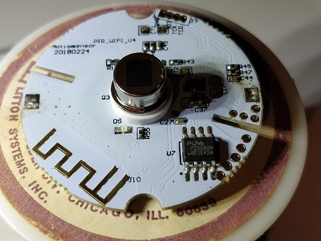
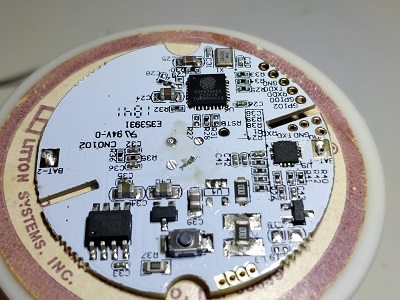

ESPHome Low-Power Wifi Sensor Support
=====================================

Work-in-progress support for low-power WiFi passive infrared (PIR) and reed switch closure sensors built on the Tuya platform. They seem to be manufactured by SHENZHEN NEO ELECTRONICS CO.,LTD, but are resold and rebadged by several other vendors. All devices I've seen share FCC ID [Z52NAS-PD01W0](https://fccid.io/Z52NAS-PD01W0) for PIR sensors and [Z52NAS-DS01W0](https://fccid.io/Z52NAS-DS01W0) for the reed switch sensors. This is the first attempt that I am aware of to document the protocol and provide working firmware for low-power battery-based Tuya devices; Tasmota and others have support for line-powered Tuya devices such as switches and dimmers.

Overview
--------

These devices embed an ESP8266 wifi processor paired with a low-power MCU. The MCU controls the LEDs, sends sensor events, and gates power to the ESP8266 when it is not needed. The MCU and ESP8266 communicate via serial UART at 9600 bps.
 
 These devices have been discussed a few places:
* https://github.com/esphome/esphome/issues/306
* https://community.home-assistant.io/t/coolcam-wifi-motion-sensor-pir/54783
* https://community.home-assistant.io/t/neo-window-door-sensors/67949
* https://www.aliexpress.com/wholesale?SearchText=coolcam+white+wifi+pir
* https://www.aliexpress.com/wholesale?SearchText=coolcam+door+window+wifi
* https://www.amazon.com/Wasserstein-Smart-Enabled-Motion-Sensor/dp/B07FXBB2HP

All battery-based devices appear to use the Silicon Labs [EMF8 'Sleepy Bee' SB1](https://www.silabs.com/products/mcu/8-bit/efm8-sleepy-bee) ultra-low-power coprocessor. Line-powered devices appear to use a wide variety of Western or Chinese MCUs. The common factor seems to be that they all use a Intel MCS-51 (8051) compatible core.


| [Product Image](images/product.jpg?raw=true)| [PCB Top](images/pcb-top.jpg?raw=true)| [PCB Bottom](images/pcb-bottom.jpg?raw=true)|
|---------------------------------------------|---------------------------------------|---------------------------------------------|
|       |       |       |

Initial Flashing
----------------

You will need a USB-TTL converter, some small probe clips, and a 3.3v supply. The device can be powered off the battery, but I prefer to use an external supply. You must at least remove the battery before connecting everything in order to get the ESP into the bootloader.


1.  Install esphome 1.11 or better
2.  Copy `substitutions.yaml.example` to `.substitutions.yaml` and edit to add your wifi and broker settings
3.  Run `esphome pir.yaml compile`
4.  Twist off the back of your PIR sensor; remove the battery and the two screws retaining the front cap.
5.  Connect probes to the GPIO0, RXD0, TXD0, and GND contacts (see image at right).
6.  Connect GPIO0 to GND.
7.  Connect your 3.3v supply, or insert the battery. The LEDs should blink quickly and then go out. The ESP is now online in bootloader mode, with approximately 120 seconds until the it is powered down by the coprocessor. If you wait too long, just pull the power and start over.
8.  Connect your TTL serial device to the RXD0, TXD0, and GND probes.
9. Run `esphome pir.yaml upload` and select your serial port. If the upload fails, check that you connected everything in the proper order. In particular, having the serial device connected before powering up the ESP will prevent it from entering the bootloader. If in doubt, disconnect the power and serial converted and start over at step 7.
10. Disconnect everything and reassemble the sensor.
11. Insert the battery, and hold down the button until the LED goes solid and then begins flashing. The ESP is now running esphome, and is in OTA mode.
12. Wait approximately 35 seconds for the device to reboot into normal mode. It should now function normally.

OTA Updates
-----------

Once the device is operational, it will only be on the network for a few seconds when motion events are detected. In order to hold it online long enough to perform an OTA update, open up the back of the sensor and hold down the button until the LEDs begin blinking continuously. You now have 30 seconds to initiate an OTA update. The LEDs will continue blinking until the device has completed the update and rebooted into normal mode.

If the device does not detect motion after an OTA update, remove the battery and wait about 30 seconds. Reinsert the battery, hold down the button until the LEDs begin blinking, and wait approximately 35 seconds for OTA to time out and reboot. It should now function normally.


Replacing The Battery
---------------------

The device should report the battery voltage to Home Assistant. When it gets too low (down to about 2.5 volts?) it should be replaced. After replacing the battery,  hold down the button until the LEDs begin blinking, and wait approximately 35 seconds for OTA to time out and reboot. It should now function normally.

The manual suggests that 1500 mAh battery is good for about 18,000 events (motion + clear * 25 per day * 365 days) with the stock firmware. I haven't validated this or compared stock firmware to esphome, but obviously more time spent online (lots of events, OTA, etc) will drain it faster.

Serial Protocol Overview
------------------------

Version 3 of the Tuya MCU serial protocol is documented here: https://docs.tuya.com/en/mcu/mcu-protocol.html

Battery-powered devices seem to use version 0 of the serial protocol, which is not documented anywhere that I can find, and differs significantly from version 3. These are the version 0 messages I have seen the two processors exchange during limited bench testing. There may be more.

The protocol is a simple command-length-value sequence, with a fixed header and trailing 1-byte modulo-265 sum of the previous bytes, including the header. It looks something like this:

```C
// multi-byte values are sent in network (big-endian) byte order

struct TuyaMessage {
  uint16_t header;  // Fixed: 0x55AA
  uint8_t version;
  uint8_t command;
  uint16_t length;
  unit8_t value[];  // Variable length. May contain simple value, or DataPoint struct, depending on command.
  uint8_t checksum;  // Sum of all previous bytes, modulo 256
};

struct DataPoint {
  uint8_t id;
  uint8_t type;
  uint16_t length;
  uint8_t value[];   // Variable length
}
``` 

Handshake
---------

The first message is always a product ID request from the ESP to the MCU.

The `0x01` command code is used by both the request and response.

**Product ID Handshake:**
```
ESP8266 -> MCU: 55 AA 00 01 00 00 00
MCU -> ESP8266: 55 AA 00 01 00 ${"P":"Okurono2XLVRV0fB","v":"1.1.0"} 19
```

Configuration Status
--------------------

After handshaking, the sequence may go to one of three different paths as the ESP8266 is configured by the smartphone app and connnects to the cloud service.

The `0x02` command code is used by all status messages and responses.

**WiFi SmartConfig AP (Fast Blink) Mode:**
```
ESP8266 -> MCU: 55 AA 00 02 00 01 00 02
MCU -> ESP8266: 55 AA 00 02 00 00 01
```

**Wifi SmartConfig STA (Slow Blink) Mode:**
```
ESP8266 -> MCU: 55 AA 00 02 00 01 01 03
MCU -> ESP8266: 55 AA 00 02 00 00 01
```

**Normal (Configured) Mode:**
```
# WiFi Connected
ESP8266 -> MCU: 55 AA 00 02 00 01 02 04
MCU -> ESP8266: 55 AA 00 02 00 00 01

# IP Address Received from DHCP
ESP8266 -> MCU: 55 AA 00 02 00 01 03 05
MCU -> ESP8266: 55 AA 00 02 00 00 01

# Connected to MQTT
ESP8266 -> MCU: 55 AA 00 02 00 01 04 06
MCU -> ESP8266: 55 AA 00 02 00 00 01
```

In Configured mode, if no motion event has been detected, the ESP8266 will be powered down approximately 3.5 seconds after the final status message is ackd by the MCU. In either SmartConfig mode, the ESP8266 will be powered down after aproximately 110 seconds.

Motion events will only be fired if the device has gone to sleep after being successfully configured. If the MCU does not see a successful configuration sequence, the ESP8266 will stay asleep until the reset button is held to re-initiate autoconfiguration. I'm not sure what happens if WiFI or internet access is unavailable following successful configuration; this has yet to be tested.

Configuration Reset
-------------------

The MCU may send a reset command to the ESP8266 at any time. This is triggered by holding down the button inside the device as described in the user manual. The Tuya firmware responds by removing all WiFi and Tuya configuration, and rebooting into SmartConfig mode. Repeated messages are used to toggle the device between STA and AP mode for SmartConfig. The SB1 does not seem to care if you ack this or not; it expects the ESP8266 to reboot anyway.

The `0x03` command code is used by all status messages and responses.

```
MCU -> ESP8266: 55 AA 00 03 00 00 02
ESP8266 -> MCU: 55 AA 00 03 00 00 02
```

Unknown Message
-------------

I would expect there to be a message with command code `0x04`, but I have not yet seen it.

Data Point Messages
------------

If the ESP8266 was powered up due to a sensor event, the ack to the 'Connected to MQTT' message will be immediately followed by a Data Point (DP) message. The ESP8266 will be powered down immediately after acking the DP message. The message should NOT be ackd until whatever notification you're going to send has been successfully transmitted across the network.

The DP payload has does not change between protocol versions, but version 0 of the protocol appears to use command code `0x05` for all DP messages.

I have not been able to find a complete list of dpID Function Points. dpIDs between 1 and 100 (`0x64`) are predefined in the platform. dpIDs starting with `0x65` are custom. Ultimately it is up to the developer to map a dpID to a type, function, and unit in the product's UI definition.

**Type values:**
* `0x00`: Byte Array/RAW (no fixed size)
* `0x01`: Boolean (1 byte, 0/1)
* `0x02`: Integer (4 byte)
* `0x03`: String/Char (no fixed size)
* `0x04`: Enum (1 byte)
* `0x05`: Bitmask/Fault (2 bytes)

Sensor events will not be sent more than once per boot of the ESP.
* `01 04 00 01 xx`  - Door open(0)/closed(1)
* `65 04 00 01 xx`  - Door sensor battery level (low/mid/high)?
* `65 01 00 01 xx`  - Motion sensor motion cleared(0)/detected(1)
* `66 04 00 01 xx`  - Motion sensor battery level (low/mid/high)?

```
MCU -> ESP8266: 55 AA 00 05 00 05 65 01 00 01 00 70
ESP8266 -> MCU: 55 AA 00 05 00 01 00 05
```

MCU Desync
----------

In order to send motion events, the MCU coprocessor needs to see the ESP boot successfully all the way to the 'Connected to MQTT' state. Once this is done, it will put the ESP to sleep until motion is detected. If it does not see the correct boot sequence, it will not detect motion and will never wake the ESP.

Normally the ESP can cycle through reset(OTA) and normal modes without issue, but it seems that sometimes the MCU gets confused about what state the ESP is in, and will refuse to wake the ESP even after a successful boot sequence. If this occurs, it is necessary to reset the SB1 by removing the battery for 20-30 seconds, and then reinsert it and run the ESP through a reset/normal boot sequence. Once that is done it should function normally again.
